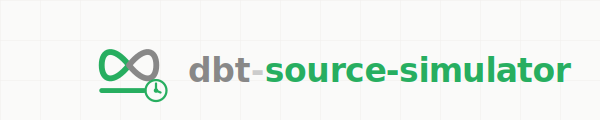

<p align="center">
  <picture>
    <source media="(prefers-color-scheme: dark)" srcset="docs/assets/github-banner-dark.svg">
    <source media="(prefers-color-scheme: light)" srcset="docs/assets/github-banner-light.svg">
    
  </picture>
</p>

<p align="center">
  <em>Fake source systems so you can focus on the interesting stuff.</em>
</p>

<p align="center">
  <a href="https://github.com/feriksen-personal/dbt-source-simulator/actions/workflows/test-package.yml"></a>
  <a href="https://opensource.org/licenses/MIT"></a>
  <a href="https://docs.getdbt.com/docs/introduction"></a>
</p>

---

## What is this?

Pre-built source databases (ERP + CRM) with predictable data that evolves over time. Four commands. Done.

**Use it when you want to:**
- Test CDC, change tracking, or ingestion patterns
- Demo Lakeflow Connect, Fivetran, or custom pipelines  
- Validate SCD2 or incremental load logic
- Run a workshop where everyone needs identical source data
- Explore something new without building plumbing first

**Skip it when:**
- You need production-like scale or complexity
- Your actual source systems are available for testing

---

## Quick Start

```yaml
# packages.yml
packages:
  - git: "https://github.com/feriksen-personal/dbt-source-simulator"
    revision: v1.0.0
```

```bash
dbt deps
dbt run-operation origin_load_baseline    # Day 0: initial data
dbt run-operation origin_apply_delta --args '{day: 1}'   # Day 1: inserts, updates, deletes
dbt run-operation origin_apply_delta --args '{day: 2}'   # Day 2: more changes
dbt run-operation origin_status           # What state am I in?
dbt run-operation origin_reset            # Back to Day 0
```

> Use `--profile ingestion_simulator` to target your source database, not your warehouse.

---

## What You Get

Two fake source systems inspired by [Jaffle Shop](https://github.com/dbt-labs/jaffle_shop):

| System | Tables | What changes |
|--------|--------|--------------|
| **jaffle_shop** (ERP) | customers, products, orders, order_items, payments | Email updates, status transitions, soft deletes, new orders |
| **jaffle_crm** (Marketing) | campaigns, email_activity, web_sessions | New events, campaign updates |

Each table has `created_at` and `updated_at` for CDC detection.

**Day 0** → Baseline data  
**Day 1** → Some inserts, updates, soft deletes  
**Day 2** → More of the same  
**Day 3** → You get the idea

Same data every time. Customer #6 always appears in Day 1. Order #12 always gets updated in Day 2. Deterministic = testable.

---

## Platforms

| Platform | Notes |
|----------|-------|
| **DuckDB** | Local dev, CI/CD. Zero cost. |
| **MotherDuck** | Shared sources for teams |
| **Databricks** | Unity Catalog, Delta Sharing patterns |
| **Azure SQL** | CDC/change tracking enabled |

Start local, deploy to cloud if you need to. Same data, same deltas.

---

## Extras

The `extras/` folder has ready-to-use templates:

- **dbt**: `sources.yml`, profile examples
- **Soda Core**: Data contracts and deterministic test scans
- **ODCS/Bitol**: Open Data Contract Standard definitions
- **VS Code**: Command palette tasks
- **GitHub Actions**: CI workflow template

---

## When This Shines

**"I have a demo Thursday"** — Load baseline, apply a delta, show the pipeline handling changes. Reset and repeat.

**"Does my SCD2 logic actually work?"** — You know exactly what changed between Day 1 and Day 2. Write assertions with confidence.

**"I want to compare Lakeflow vs. custom Spark ingestion"** — Same source data, different approaches. Apples to apples.

**"New person joining the team"** — Point them at the simulator. Let them break things, learn the stack, reset in seconds.

**"CDC patterns are confusing"** — Explore change tracking on Azure SQL without touching production. See what shows up, understand the mechanics.

---

## What This Isn't

- Not a load testing tool (small dataset by design)
- Not a replacement for production source system testing  
- Not trying to simulate every edge case

It's a utility. Saves you setup time so you can focus on the thing you actually want to build or learn.

---

## Links

- [Wiki](https://github.com/feriksen-personal/dbt-source-simulator/wiki) — Detailed docs
- [Operations Guide](https://github.com/feriksen-personal/dbt-source-simulator/wiki/Operations-Guide) — All four commands explained
- [Schema Reference](https://github.com/feriksen-personal/dbt-source-simulator/wiki/Data-Schemas) — What changes in each delta

---

## Contributing

Contributions welcome. See [CONTRIBUTING.md](CONTRIBUTING.md).

## License

MIT
