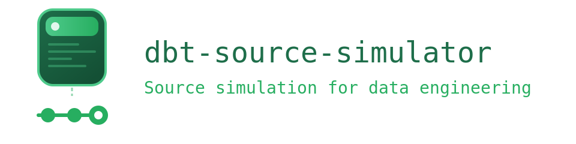

<p align="center">
  
</p>

[](https://github.com/feriksen-personal/dbt-source-simulator/actions/workflows/test-package.yml)
[](https://opensource.org/licenses/MIT)
[](https://docs.getdbt.com/docs/introduction)
[](https://github.com/duckdb/dbt-duckdb)
[](https://github.com/databricks/dbt-databricks)
[](https://github.com/dbt-msft/dbt-sqlserver)

**Control plane for deterministic, incremental source system simulation** — four operations to manage upstream databases your ingestion pipelines pull from. Test Lakeflow Connect, Fivetran, CDC patterns, or custom ingestion against controlled source incremental changes.

**[Quick Start](#quick-start)** • **[Wiki](https://github.com/feriksen-personal/dbt-source-simulator/wiki)** • **[Operations Guide](https://github.com/feriksen-personal/dbt-source-simulator/wiki/Operations-Guide)**

---

## Quick Start

```yaml
# packages.yml
packages:
  - git: "https://github.com/feriksen-personal/dbt-source-simulator"
    revision: v1.0.0
```

```bash
dbt deps
dbt run-operation origin_load_baseline --profile ingestion_simulator
dbt run-operation origin_apply_delta --args '{day: 1}' --profile ingestion_simulator
dbt run-operation origin_status --profile ingestion_simulator
```

> ⚠️ Always use `--profile` to target your source database connection — never run against your default (target) profile. The VS Code tasks in `extras/` handle this automatically.

---

## What This Creates

This package creates and manages **source databases** — the upstream systems your pipelines ingest *from*, not the destination.

Two simulated systems (inspired by dbt Labs' [Jaffle Shop](https://github.com/dbt-labs/jaffle_shop)):
- **jaffle_shop** — ERP/e-commerce: customers, products, orders, order_items, payments
- **jaffle_crm** — Marketing platform: campaigns, email_activity, web_sessions

Your dbt project, Lakeflow Connect, Fivetran, or Spark jobs consume these as external sources.

---

## Core Concepts

**Source-side simulation** — This package manages the databases your pipelines ingest *from*, not your target warehouse. Think of it as a controllable stand-in for production ERP, CRM, and marketing systems.

**Deterministic** — Same data every run. Customer #6 always appears in Day 1. Order #12 always gets updated in Day 2. Write assertions, document expected results, debug with confidence.

**Incremental** — Controlled progression through deltas. Each delta introduces new records, updates existing ones, and soft-deletes others — mirroring real source system behavior over time.

**Portable** — Develop locally on DuckDB (zero cost), deploy source databases to Databricks or Azure SQL. Same schemas, same increments, different platforms.

---

## Operations

| Operation | Purpose | Example |
| --- | --- | --- |
| `origin_load_baseline` | Initialize source systems with Day 0 data | `dbt run-operation origin_load_baseline --profile ingestion_simulator` |
| `origin_apply_delta` | Apply incremental changes (day 1/2/3) | `dbt run-operation origin_apply_delta --args '{day: 1}' --profile ingestion_simulator` |
| `origin_reset` | Reset sources to baseline state | `dbt run-operation origin_reset --profile ingestion_simulator` |
| `origin_status` | Inspect current source state | `dbt run-operation origin_status --profile ingestion_simulator` |

📚 **[Detailed Operations Guide →](https://github.com/feriksen-personal/dbt-source-simulator/wiki/Operations-Guide)**

---

## Use Cases

**Validate ingestion and transformation** — Test dbt projects, Lakeflow Connect, Fivetran, or custom CDC against sources that increment predictably. Know exactly what changed between Day 1 and Day 2.

**Verify SCD Type 2 logic** — Deterministic updates and soft deletes let you validate historization patterns. Confirm your slowly changing dimension logic handles updates, deletes, and restatements correctly.

**Test CDC/change tracking** — Azure SQL sources with change tracking enabled, letting you validate SQL Server-native CDC ingestion patterns before hitting production.

**CI/CD for pipelines** — Spin up source databases in GitHub Actions (DuckDB), run your full ingestion + transformation pipeline, assert on known outcomes. No cloud costs for testing.

**Develop locally, deploy to cloud** — Build ingestion logic against local DuckDB sources, then deploy the same pipeline against Databricks or Azure SQL sources. Same data, same increments.

**Workshops and demos** — Everyone connects to identical source systems. Reset between sessions in seconds. Demonstrate incremental loads with predictable before/after states.

---

## Batteries Included

The `extras/` folder provides production-ready templates:

**dbt integration**
- `sources.yml` — Complete source definitions with column descriptions and freshness checks
- `profiles.yml.example` — Connection templates for DuckDB, MotherDuck, Databricks, Azure SQL

**Data quality — Soda Core**
- `contracts/` — Generic validation patterns (schema, integrity, business rules)
- `scans/` — Deterministic integration tests with exact row counts per state (baseline, day 1, day 2, day 3)

**Data quality — ODCS (Bitol)**
- Eight Open Data Contract Standard definitions (one per table)
- Compatible with `datacontract-cli` for validation and code generation

**Developer experience**
- `tasks.json` — VS Code Command Palette actions for all operations
- `github-actions.yml` — CI/CD workflow with baseline, incremental, and matrix testing jobs

📁 **[Extras documentation →](https://github.com/feriksen-personal/dbt-source-simulator/tree/main/extras)** • **[Wiki →](https://github.com/feriksen-personal/dbt-source-simulator/wiki)**

---

## Platforms

| Platform | Source Database Use Case | Status |
| --- | --- | --- |
| **DuckDB** | Local sources for development, CI/CD | ✅ Supported |
| **MotherDuck** | Shared sources for team collaboration | ✅ Supported |
| **Databricks** | Unity Catalog sources, Delta Sharing ingestion patterns | ✅ Supported |
| **Azure SQL** | CDC-enabled sources, change tracking ingestion patterns | ✅ Supported |

---

## Source Schemas

**jaffle_shop** (ERP/e-commerce)
- `customers` — Soft deletes, email updates
- `products` — Price changes, static catalog
- `orders` — Status transitions, soft deletes
- `order_items` — Append-only line items
- `payments` — Append-only, added in deltas

**jaffle_crm** (Marketing)
- `campaigns` — Slowly changing reference data
- `email_activity` — Append-only event stream
- `web_sessions` — Append-only event stream

All tables include `created_at`, `updated_at` for CDC detection.

📊 **[Schema documentation with delta patterns →](https://github.com/feriksen-personal/dbt-source-simulator/wiki/Data-Schemas)**

---

## Configuration

```yaml
# dbt_project.yml (optional)
vars:
  dbt_source_simulator:
    shop_db: 'jaffle_shop'  # default
    crm_db: 'jaffle_crm'    # default
```

Profile examples for each platform: **[Setup Guide →](https://github.com/feriksen-personal/dbt-source-simulator/wiki/Getting-Started)**

---

## Project Structure

```
dbt-source-simulator/
├── macros/                     # Four operations
├── data/
│   ├── duckdb/                 # DuckDB/MotherDuck source definitions
│   ├── databricks/             # Unity Catalog source definitions
│   └── azure/                  # Azure SQL sources (in development)
├── extras/
│   ├── dbt/                    # sources.yml, profiles.yml.example
│   ├── data_quality/
│   │   ├── soda/               # Contracts + deterministic scans
│   │   └── bitol/              # ODCS contracts (datacontract-cli compatible)
│   ├── vscode/                 # Command palette tasks
│   └── cicd/                   # GitHub Actions workflow
└── scripts/                    # Development utilities
```

---

## Contributing

Contributions welcome. See [CONTRIBUTING.md](CONTRIBUTING.md).

## License

MIT — see [LICENSE](LICENSE).


---

**Questions?** [Open an issue](https://github.com/feriksen-personal/dbt-source-simulator/issues) | **Detailed docs:** [Project wiki](https://github.com/feriksen-personal/dbt-source-simulator/wiki)
