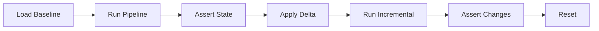

# CI/CD Integration

Automated testing with deterministic source data.

---

## The Pattern



**Why DuckDB in CI:** Fast, free, runs anywhere Python runs. No cloud credentials needed. Same deterministic data as other platforms.

**Why deterministic matters:** You can assert exact outcomes. "After Day 1, customers table should have 125 rows" — and it always does.

---

## GitHub Actions

### Basic Workflow

```yaml
name: Test Data Pipeline

on:
  push:
    branches: [main]
  pull_request:
    branches: [main]

jobs:
  test:
    runs-on: ubuntu-latest
    
    steps:
      - uses: actions/checkout@v4
      
      - name: Setup Python
        uses: actions/setup-python@v5
        with:
          python-version: '3.11'
      
      - name: Install dependencies
        run: |
          pip install dbt-core dbt-duckdb
          dbt deps
      
      - name: Load baseline sources
        run: dbt run-operation origin_load_baseline --profile ingestion_simulator
      
      - name: Run dbt models
        run: dbt run --profile my_project
      
      - name: Test baseline state
        run: dbt test --profile my_project
      
      - name: Apply Day 1 delta
        run: dbt run-operation origin_apply_delta --args '{day: 1}' --profile ingestion_simulator
      
      - name: Run incremental models
        run: dbt run --profile my_project
      
      - name: Test incremental state
        run: dbt test --profile my_project
```

### With Soda Validation

```yaml
name: Test with Data Quality

on:
  push:
    branches: [main]

jobs:
  test:
    runs-on: ubuntu-latest
    
    steps:
      - uses: actions/checkout@v4
      
      - name: Setup Python
        uses: actions/setup-python@v5
        with:
          python-version: '3.11'
      
      - name: Install dependencies
        run: |
          pip install dbt-core dbt-duckdb soda-core-duckdb
          dbt deps
      
      - name: Load baseline
        run: dbt run-operation origin_load_baseline --profile ingestion_simulator
      
      - name: Validate baseline state
        run: |
          soda scan -d ingestion_simulator \
            -c extras/data_quality/soda/configuration.yml \
            extras/data_quality/soda/scans/baseline_checks.yml
      
      - name: Run dbt models
        run: dbt run --profile my_project
      
      - name: Apply Day 1
        run: dbt run-operation origin_apply_delta --args '{day: 1}' --profile ingestion_simulator
      
      - name: Validate Day 1 state
        run: |
          soda scan -d ingestion_simulator \
            -c extras/data_quality/soda/configuration.yml \
            extras/data_quality/soda/scans/delta_day1_checks.yml
      
      - name: Run incremental models
        run: dbt run --profile my_project
      
      - name: Final validation
        run: dbt test --profile my_project
```

### Matrix Testing (Multiple Days)

```yaml
name: Matrix Test All Deltas

on:
  push:
    branches: [main]

jobs:
  test-baseline:
    runs-on: ubuntu-latest
    steps:
      - uses: actions/checkout@v4
      - uses: actions/setup-python@v5
        with:
          python-version: '3.11'
      - run: pip install dbt-core dbt-duckdb && dbt deps
      - run: dbt run-operation origin_load_baseline --profile ingestion_simulator
      - run: dbt run --profile my_project
      - run: dbt test --profile my_project

  test-deltas:
    runs-on: ubuntu-latest
    needs: test-baseline
    strategy:
      matrix:
        day: [1, 2, 3]
    
    steps:
      - uses: actions/checkout@v4
      - uses: actions/setup-python@v5
        with:
          python-version: '3.11'
      - run: pip install dbt-core dbt-duckdb && dbt deps
      
      - name: Load baseline
        run: dbt run-operation origin_load_baseline --profile ingestion_simulator
      
      - name: Apply deltas up to day ${{ matrix.day }}
        run: |
          for day in $(seq 1 ${{ matrix.day }}); do
            dbt run-operation origin_apply_delta --args "{day: $day}" --profile ingestion_simulator
          done
      
      - name: Run models
        run: dbt run --profile my_project
      
      - name: Test
        run: dbt test --profile my_project
```

---

## Azure DevOps Pipelines

### Basic Pipeline

```yaml
trigger:
  branches:
    include:
      - main

pool:
  vmImage: 'ubuntu-latest'

steps:
  - task: UsePythonVersion@0
    inputs:
      versionSpec: '3.11'

  - script: |
      pip install dbt-core dbt-duckdb
      dbt deps
    displayName: 'Install dependencies'

  - script: dbt run-operation origin_load_baseline --profile ingestion_simulator
    displayName: 'Load baseline sources'

  - script: dbt run --profile my_project
    displayName: 'Run dbt models'

  - script: dbt test --profile my_project
    displayName: 'Test baseline'

  - script: dbt run-operation origin_apply_delta --args '{day: 1}' --profile ingestion_simulator
    displayName: 'Apply Day 1 delta'

  - script: dbt run --profile my_project
    displayName: 'Run incremental models'

  - script: dbt test --profile my_project
    displayName: 'Test incremental'
```

### With Stages

```yaml
trigger:
  branches:
    include:
      - main

pool:
  vmImage: 'ubuntu-latest'

stages:
  - stage: Test_Baseline
    jobs:
      - job: Baseline
        steps:
          - task: UsePythonVersion@0
            inputs:
              versionSpec: '3.11'
          - script: pip install dbt-core dbt-duckdb && dbt deps
          - script: dbt run-operation origin_load_baseline --profile ingestion_simulator
          - script: dbt run --profile my_project
          - script: dbt test --profile my_project

  - stage: Test_Incremental
    dependsOn: Test_Baseline
    jobs:
      - job: Day1
        steps:
          - task: UsePythonVersion@0
            inputs:
              versionSpec: '3.11'
          - script: pip install dbt-core dbt-duckdb && dbt deps
          - script: dbt run-operation origin_load_baseline --profile ingestion_simulator
          - script: dbt run-operation origin_apply_delta --args '{day: 1}' --profile ingestion_simulator
          - script: dbt run --profile my_project
          - script: dbt test --profile my_project
```

---

## GitLab CI

```yaml
stages:
  - test

variables:
  PIP_CACHE_DIR: "$CI_PROJECT_DIR/.cache/pip"

cache:
  paths:
    - .cache/pip

test-pipeline:
  stage: test
  image: python:3.11
  
  before_script:
    - pip install dbt-core dbt-duckdb
    - dbt deps
  
  script:
    # Baseline
    - dbt run-operation origin_load_baseline --profile ingestion_simulator
    - dbt run --profile my_project
    - dbt test --profile my_project
    
    # Day 1
    - dbt run-operation origin_apply_delta --args '{day: 1}' --profile ingestion_simulator
    - dbt run --profile my_project
    - dbt test --profile my_project
    
    # Day 2
    - dbt run-operation origin_apply_delta --args '{day: 2}' --profile ingestion_simulator
    - dbt run --profile my_project
    - dbt test --profile my_project
```

---

## Profile Configuration for CI

Your CI environment needs a `profiles.yml`. Options:

### Option 1: Commit a CI-specific profile

```yaml
# profiles.yml (in repo root or CI config)
ingestion_simulator:
  target: ci
  outputs:
    ci:
      type: duckdb
      path: ':memory:'  # In-memory for speed
```

### Option 2: Generate at runtime

```yaml
# GitHub Actions step
- name: Create profiles
  run: |
    mkdir -p ~/.dbt
    cat > ~/.dbt/profiles.yml << EOF
    ingestion_simulator:
      target: ci
      outputs:
        ci:
          type: duckdb
          path: 'data/ci.duckdb'
    
    my_project:
      target: ci
      outputs:
        ci:
          type: duckdb
          path: 'data/ci.duckdb'
    EOF
```

### Option 3: Environment variables

```yaml
# profiles.yml
ingestion_simulator:
  target: "{{ env_var('DBT_TARGET', 'dev') }}"
  outputs:
    dev:
      type: duckdb
      path: 'data/dev.duckdb'
    ci:
      type: duckdb
      path: ':memory:'
```

```yaml
# CI step
- run: dbt run-operation origin_load_baseline --profile ingestion_simulator
  env:
    DBT_TARGET: ci
```

---

## Testing Strategies

### Strategy 1: Full Progression

Test all states sequentially:

```bash
origin_load_baseline → test → apply_delta 1 → test → apply_delta 2 → test → apply_delta 3 → test
```

**Pros:** Tests incremental logic across all transitions.
**Cons:** Slower, single failure stops chain.

### Strategy 2: Isolated States

Test each state independently (parallel jobs):

| Job | Setup | Test |
|-----|-------|------|
| Baseline | `load_baseline` | Test Day 0 state |
| Day 1 | `load_baseline` + `apply_delta 1` | Test Day 1 state |
| Day 2 | `load_baseline` + `apply_delta 1` + `apply_delta 2` | Test Day 2 state |
| Day 3 | `load_baseline` + all deltas | Test Day 3 state |

**Pros:** Parallel execution, isolated failures.
**Cons:** More setup time per job.

### Strategy 3: Reset Between Tests

Test specific scenarios with reset:

```bash
load_baseline → test scenario A → reset → load_baseline → apply_delta 1 → test scenario B → reset
```

**Pros:** Clean state for each scenario.
**Cons:** Slower due to resets.

---

## Assertions

Because data is deterministic, you can write exact assertions:

### dbt Tests

```yaml
# models/schema.yml
models:
  - name: dim_customers
    tests:
      - dbt_utils.equal_rowcount:
          compare_model: source('jaffle_shop', 'customers')
```

### Custom Row Count Tests

```sql
-- tests/assert_customer_count_day1.sql
-- Expected: 125 customers after Day 1
select 1
from {{ source('jaffle_shop', 'customers') }}
having count(*) != 125
```

### Soda Checks

```yaml
# Exact row count after Day 1
checks for customers:
  - row_count = 125
```

---

## Tips

**Use in-memory DuckDB for speed:**
```yaml
path: ':memory:'
```

**Cache dbt packages:**
```yaml
- uses: actions/cache@v3
  with:
    path: dbt_packages
    key: dbt-packages-${{ hashFiles('packages.yml') }}
```

**Fail fast:** Put baseline tests first. If baseline fails, skip deltas.

**Artifact the database:** For debugging failed runs:
```yaml
- uses: actions/upload-artifact@v3
  if: failure()
  with:
    name: duckdb-database
    path: data/*.duckdb
```
