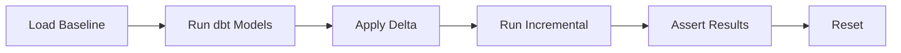
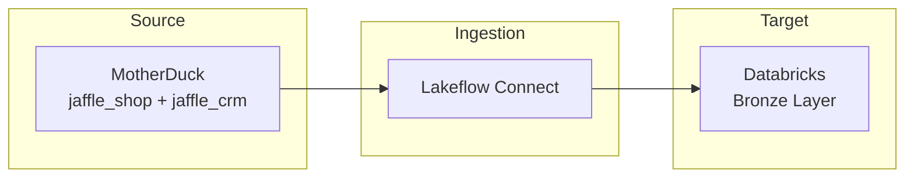
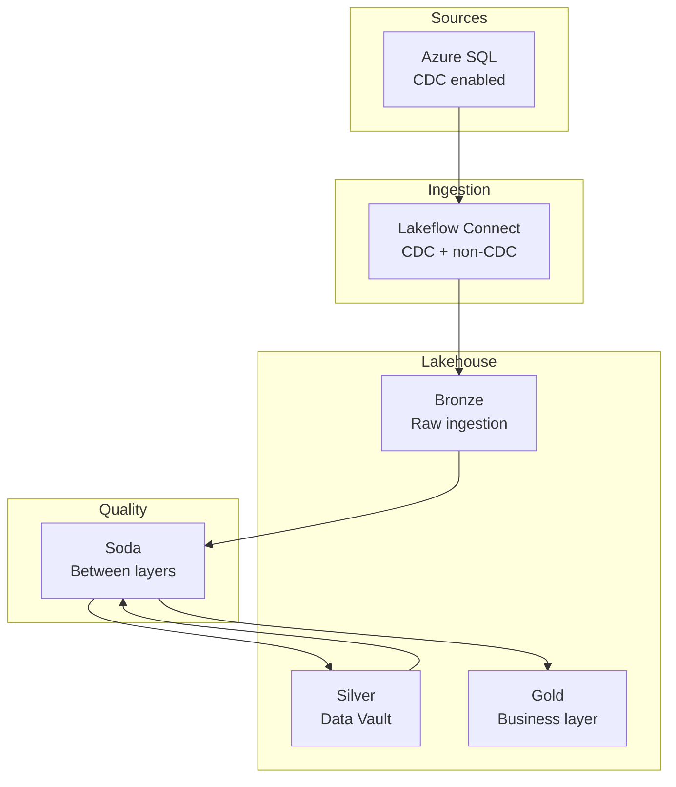

# Use Cases and Platforms

When to use what, and how it all fits together.

---

## Platform Selection

| If you need... | Use | Why |
|----------------|-----|-----|
| Local development, zero cost | **DuckDB** | Instant setup, no credentials, works offline |
| CI/CD pipeline testing | **DuckDB** | Fast, free, deterministic assertions |
| Team collaboration | **MotherDuck** | Cloud-hosted DuckDB, shareable |
| Cloud-based ingestion (Lakeflow, etc.) | **MotherDuck** | Accessible from cloud pipelines |
| Unity Catalog patterns | **Databricks** | Native integration, catalog governance |
| Delta Sharing ingestion | **Databricks** | Test share-based consumption patterns |
| CDC / change tracking | **Azure SQL** | SQL Server-native CDC support |

---

## Use Cases in Detail

### Local Development

**Goal:** Fast iteration with zero cloud costs.

**Platform:** DuckDB

**Workflow:**
1. Load baseline locally
2. Develop and test your dbt models
3. Apply deltas to test incremental logic
4. Reset and repeat

```bash
dbt run-operation origin_load_baseline --profile ingestion_simulator
dbt run --profile my_project
dbt run-operation origin_apply_delta --args '{day: 1}' --profile ingestion_simulator
dbt run --profile my_project  # Test incremental models
```

---

### CI/CD Pipeline Testing

**Goal:** Automated testing with predictable assertions.

**Platform:** DuckDB (in GitHub Actions, Azure DevOps, etc.)

**Why it works:** Deterministic data means you can assert exact row counts. DuckDB runs anywhere Python runs — no cloud credentials needed in CI.



See [CI/CD Integration](CI-CD-Integration) for workflow templates.

---

### Validating Ingestion Patterns

**Goal:** Test how your pipeline handles source changes before hitting production.

**Platforms:** Any — choose based on your production target.

**What you can validate:**
- Incremental loads (new records appear correctly)
- CDC detection (changed records captured)
- Soft delete handling (`deleted_at` patterns)
- SCD Type 2 historization (updates create new versions)

**Workflow:**
1. Load baseline → run pipeline → verify initial state
2. Apply Day 1 → run pipeline → verify new + updated records
3. Apply Day 2 → run pipeline → verify soft deletes handled
4. Reset and test edge cases

---

### SCD Type 2 Verification

**Goal:** Confirm your slowly changing dimension logic handles updates, deletes, and restatements correctly.

**Platforms:** Any

**Why this package helps:** Deterministic updates mean you know exactly which records change and when. Customer #101 always appears in Day 1. Order #561 always gets status updated in Day 2.

**Test pattern:**
1. Load baseline → build dimensions
2. Apply delta → verify new dimension records created
3. Check: Are historical records preserved? Are current flags correct?

---

### Lakeflow Connect Testing

**Goal:** Validate Lakeflow Connect configurations against evolving sources.

**Platforms:** MotherDuck (source) → Databricks (target)

**Why MotherDuck:** Cloud-accessible source that Lakeflow can connect to. Same deterministic data, but reachable from Databricks.



**Workflow:**
1. Load baseline in MotherDuck
2. Configure Lakeflow connector
3. Run initial sync → verify bronze tables
4. Apply delta in MotherDuck
5. Run incremental sync → verify changes propagated

---

### Delta Sharing Consumption

**Goal:** Test pipelines that consume data via Delta Sharing protocol.

**Platform:** Databricks

**Scenario:** You're the *recipient* of a Delta Share. You need to test how your pipeline handles incremental updates arriving via the share.

**How it works:**
1. Origin Simulator creates Delta tables in Unity Catalog
2. Tables are exposed via Delta Share
3. Your pipeline reads from the share (not direct table access)
4. Same deterministic increments, different access pattern

---

### CDC / Change Tracking Validation

**Goal:** Test SQL Server-native CDC ingestion patterns.

**Platform:** Azure SQL

**Why Azure SQL:** DuckDB and Databricks don't support SQL Server-style change tracking. If your production sources are SQL Server and your ingestion relies on CDC, you need a source that behaves the same way.

**What you can test:**
- Change tracking queries return expected changes
- CDC tables capture inserts, updates, deletes
- Your ingestion handles CDC format correctly

---

### Workshops and Training

**Goal:** Consistent, resettable environments for all participants.

**Platforms:** 
- DuckDB — each participant runs locally
- MotherDuck — shared environment, everyone sees same data

**Why deterministic matters:** Every participant sees identical results. "After Day 1, you should have 125 customers" — and everyone does.

**Workshop flow:**
1. Participants load baseline
2. Work through exercises
3. Reset between sessions
4. Repeat for next cohort

---

### Full Stack Demo

**Goal:** Demonstrate a complete modern data stack.

**Example architecture:**



**Components:**
- **Source:** Azure SQL with change tracking (this package)
- **Ingestion:** Lakeflow Connect (one CDC, one snapshot)
- **Transformation:** dbt with Data Vault methodology
- **Quality:** Soda contracts between each layer

**Why it works:** Deterministic source evolution lets you demonstrate the full flow with predictable outcomes. Reset and repeat for different audiences.

---

## Platform Comparison

| Capability | DuckDB | MotherDuck | Databricks | Azure SQL |
|------------|--------|------------|------------|-----------|
| Local development | ✅ | ❌ | ❌ | ❌ |
| CI/CD friendly | ✅ | ⚠️ (needs token) | ⚠️ (needs credentials) | ⚠️ (needs credentials) |
| Team sharing | ❌ | ✅ | ✅ | ✅ |
| Cloud pipeline access | ❌ | ✅ | ✅ | ✅ |
| Unity Catalog | ❌ | ❌ | ✅ | ❌ |
| Delta Sharing | ❌ | ❌ | ✅ | ❌ |
| CDC / Change tracking | ❌ | ❌ | ❌ | ✅ |
| Cost | Free | Free tier | Free tier | Free tier |

---

## Choosing Your Setup

**Starting out?** → DuckDB locally. Zero friction.

**Need team access?** → MotherDuck. Same simplicity, cloud-hosted.

**Testing lakehouse patterns?** → Databricks. Unity Catalog, Delta Sharing.

**Testing CDC ingestion?** → Azure SQL. SQL Server-native patterns.

**CI/CD?** → DuckDB. Always DuckDB. Fast, free, deterministic.

**Production-like demo?** → Match your production stack. If you're deploying to Databricks, test against Databricks sources.
